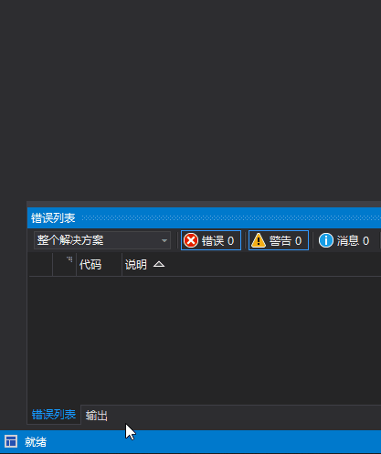

# Repository Index for Visual Studio extension development

## Solution Explore

- [ProjectFilter](https://github.com/reduckted/ProjectFilter)

  A Visual Studio extension to quickly load and unload projects. Perfect for large solutions.  
  You can learn how to gather Project Info in the solution, and how to extend solution explorer feature.  
  You can also learn learn how to use Keyboard Shortcuts.  

  
 
## Status bar

- [VS Window Manager](https://github.com/justcla/VSWindowManager)
  
  show a window manager in status bar.
  
  

- [HotStatus](https://github.com/justcla/HotStatus)
  
  display compile error in status bar.

## JIT

- [Disasmo](https://github.com/EgorBo/Disasmo)
About  
VS2019 Add-in. Click on any method or class to see what .NET Core's JIT generates for them (ASM).  

